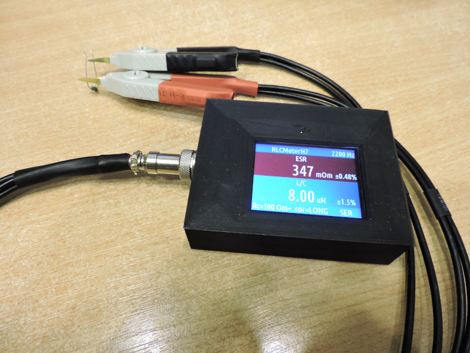
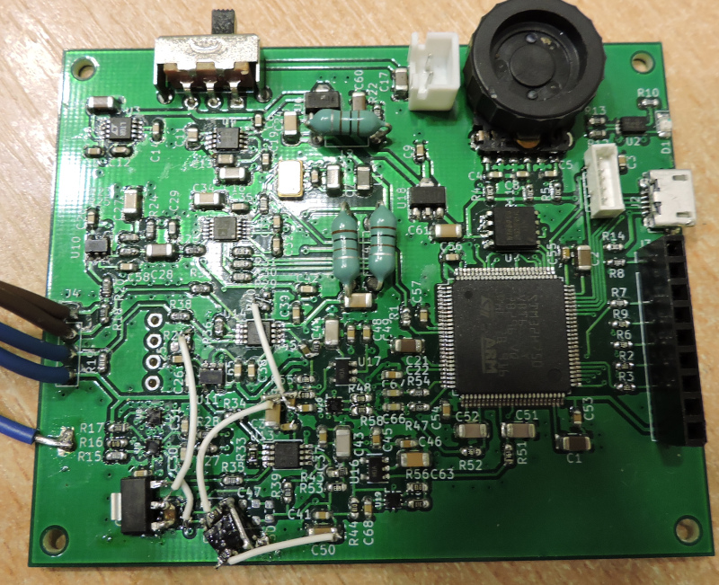

# RLCMeterH750
Это RLC построенный на STM32H750.
Основные отличительные особенности:
* использование быстрого 16-ти битного ADC от STM32H750
* широкий диапазон тестовых частот 10 Гц - 500 КГц

Про точность не буду сильно распинаться, ибо сам точно не знаю.
Но приблизительно опишу.
Сопротивления измеряются в диапазоне от единиц миллиом до сотен килоом.
Но десятые доли пикофарада без проблемм можно измерить. На частотах 100 КГц и выше.
Десятки наногенри тоже вполне можно измерять. Тоже на высоких частотах, но тут желательно теорию подучить, чтобы понимать что измеряется.
На низких частотах вполне можно измерять десятки милифарад и единицы генри.

И да, внимание!!!! Финальной PCB нет в этом проекте. На плату RLCMeterH750_v2 я вкорячил детали от схемы RLCMeterH750_v3. Собственно говоря вариант RLCMeterH750_v2 тоже полностью рабочий, но он имеет отвратительно большие ошибки на частотах ниже 300 Гц. RLCMeterH750_v3 исправляет резонансы, которые были не учтены мной.

### Тут много ссылок на посты в Livejournal про то как шла разработка.
* [Пост 157420](https://balmerdx.livejournal.com/157420.html)
* [Пост 157827](https://balmerdx.livejournal.com/157827.html)
* [Пост 158370](https://balmerdx.livejournal.com/158370.html)
* [Пост 159728](https://balmerdx.livejournal.com/159728.html)
* [Пост 160005](https://balmerdx.livejournal.com/160005.html)
* [Пост 160708](https://balmerdx.livejournal.com/160708.html)
* [Пост 160803](https://balmerdx.livejournal.com/160803.html)
* [Пост 161141](https://balmerdx.livejournal.com/161141.html)
* [Пост 161592](https://balmerdx.livejournal.com/161592.html)

